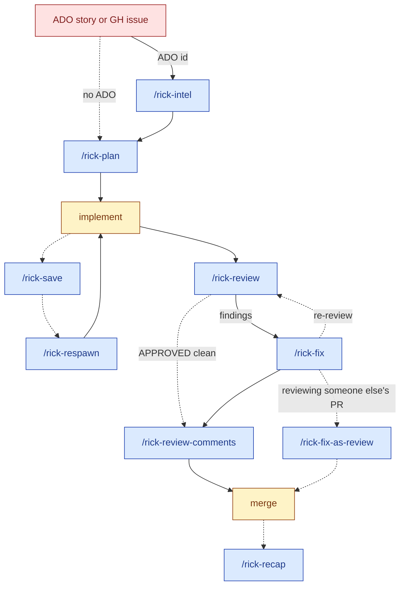

# deren-skills

My personal collection of Claude Code skills.

## Install

Uses the [skills.sh](https://skills.sh) installer:

```bash
npx skills@latest add BambooXLotus/deren-skills
```

You'll be prompted to pick which skills to install and which agent (Claude Code, Codex, etc.) to install them on.

To update later, re-run the same command — the installer will refresh existing skills.

## What's in here

### Rick skills (`skills/rick/`)

**The idea.** In *Rick and Morty*, Rick exists across a multiverse as countless parallel versions, each specialised — Pickle Rick is a different Rick from Doofus Rick is a different Rick from Rick C-137. When a Rick dies, a backup respawns from a save. When one Rick is stuck, he hands off to another. The rick-* skills are that idea applied to coding with an agent: each skill is a different Rick, good at one specific thing, able to hand work off to the next Rick and resume from a save. The agent is Rick; you're Morty — the one who needs Rick to figure it out, and the one Rick is brutally honest with because pretending otherwise gets Morty killed.

**How the metaphor maps.** A feature's full thread lives in one folder under `docs/rick/<folder>/` (typically the branch name, e.g. `48-rotate-share-token/`). Each parallel session is its own Rick from that folder's timeline. `rick-review` is the most literal multiverse mapping: seven named Ricks and Mortys from the show review your diff in parallel — Rick C-137, Doofus Rick, Smart Morty, Rick Prime, Pickle Rick, Scientist Rick, Evil Morty — each scoped to what they're good at (architecture, data layer, security, tests). `rick-recap` deliberately *isn't* a Rick: it's the Audit Observer from S7E6 "Rickfending Your Mort," because grading the day needs a voice that isn't already in the trenches.

**The loop.** Pick an issue. `/rick-intel <AB-id>` (when there's an ADO work item) gathers the dossier — reads the work item + parent epic, sweeps `vexis-docs/` and `docs/adr/`, writes findings to `<folder>/intel/current.md`. The folder name is **the branch you'd create after reading** — predicted from the ADO title via the same slug rule rick-plan uses for GitHub issues, so `git checkout -b <folder>` later keeps all the feature's artifacts under one roof. `/rick-plan <issue-number>` reads the code (and the intel if present) and writes an opinionated plan to `<folder>/plan/current.md`. You implement against the plan. `/rick-save` writes a dense briefing to `<folder>/saves/<timestamp>.md` and the session ends — that Rick "dies." Tomorrow, `/rick-respawn` boots a fresh Rick from that save with full context of where the last one left off. When the PR's ready, `/rick-review` runs the council; `/rick-fix` resolves their findings with TDD or surgical edits. At day's end, `/rick-recap` audits what actually shipped vs what was just motion. Same `<folder>` threads the whole loop — a feature's intel, plan, saves, reviews, and recaps stay co-located.

**The flow.** Same folder, different artifacts, one feature thread. Solid arrows are the normal path; dashed arrows are optional skips (no ADO story, no need to hand off, no findings).



Who reads what, who writes what:

| Skill | Reads | Writes |
| --- | --- | --- |
| `/rick-intel` | ADO work item + parent epic, `vexis-docs/`, `docs/adr/` | `<folder>/intel/current.md` |
| `/rick-plan` | intel dossier (if present) + source code + `CLAUDE.md` | `<folder>/plan/current.md`, initial `v1.md` |
| `/rick-save` | git state + session context | `<folder>/saves/<ts>.md` |
| `/rick-respawn` | newest `<folder>/saves/<ts>.md` | (boots the next session in place) |
| `/rick-review` | diff + intel dossier + PR body + prior versions | `<folder>/review/current.md`, `agents/v<N>/*.md` |
| `/rick-fix` | `<folder>/review/current.md` | source code + FIXED/SKIPPED/BLOCKED markers in the report |
| `/rick-fix-as-review` | `<folder>/review/current.md` + the working-tree fixes rick-fix just landed | `<folder>/review/proposed-fixes.patch` + `proposed-specs/`, then a PENDING GitHub PR review (suggestion blocks, neutral voice) |
| `/rick-review-comments` | `<folder>/review/current.md` | `<folder>/review/current-comments.md` (drop-in for the human reviewer) |
| `/rick-recap` | today's `saves/<ts>.md` across all folders | `<folder>/recaps/<ts>.md` (folder-scoped) or `_recaps/<ts>.md` (cross-folder) |

The meta skills sit outside the loop. `/rick-mode` activates the Rick persona for ad-hoc analysis or pairing — no folder artifact. `/rick-improve` and `/rick-plan-improve` edit the skill prompts and plan files themselves, with their own `versions/` history alongside the target.

**Why this exists.** Working with Claude on a real codebase hits two failure modes: sessions are ephemeral (conversation context dissolves when you close the tab; the next Claude has no idea what was decided), and Claude defaults to agreeable hedging, which is poison for plan critique and PR review. The rick-* skills add (1) an on-disk thread that survives session death so multi-day work doesn't restart from zero, and (2) a brutal-honesty persona that strips the hedging when you need a real opinion.

All TypeScript-flavored — no NestJS or TypeORM lock-in.

| Skill | Description |
| --- | --- |
| `rick-intel` | Gather research on an ADO work item. Reads the work item + parent epic, sweeps `vexis-docs/` and `docs/adr/` for matching domain anchors and keyword hits, writes a per-story dossier to `docs/rick/<folder>/intel/current.md` where `<folder>` is the current feature branch (or the predicted branch name `<digits>-<title-slug>` when run pre-branch, so artifacts co-locate after you create the branch). Posts an HTML disclaimer comment back to ADO and links to bd if installed. Idempotent — re-runs without `--refresh` are free. Pure research, no code. Sister of `rick-plan`. |
| `rick-plan` | Plan a piece of work in Rick's voice. Reads the code first (and any `<folder>/intel/current.md` dossier if `rick-intel` seeded one), writes an opinionated numbered plan to `docs/rick/<folder>/plan/current.md`, surfaces decisions (with Rick's pick + tradeoff), and an explicit out-of-scope list. Intel propagation contract: Story Context lands in the header, findings carry into Verified context with their cites verbatim, each acceptance criterion is claimed by a `Satisfies: AC-N` annotation on a plan step, and open questions must be answered, become a Decision row, or land in Not-in-scope (no silent drops). Suggests `/rick-intel` when an AB-id resolves but no dossier exists; warns when the existing dossier is >14 days stale. |
| `rick-plan-improve` | Bounded 3-round improvement loop on the canonical plan. Snapshots pre/post alongside the canonical at `docs/rick/<folder>/plan/v<N>-pre.md` and `v<N>.md`. Critiques against weakness categories (specification gaps, engineering hazards, convention violations, document quality), surgical edits only, 500-line cap. Explicit invocation only. Pairs with `rick-plan` like `rick-fix` pairs with `rick-review`. |
| `rick-save` | Captures the current warm thread as `docs/rick/<folder>/saves/<ts>.md`. Folder = current branch name. Writes a dense second-person briefing for the next session. |
| `rick-respawn` | Boots a new session from the most recent (or named) save. Summarizes situation, last move, blockers, and Rick mode. |
| `rick-mode` | Activate the Rick Sanchez persona for brutal architectural review. Pre-Review Protocol (read the file, trace deps + type surface, verify `package.json` + `tsconfig.json`), TS escape-hatch hunting (`as any`, `!`, `@ts-ignore`), Expected / Actual / Consequence findings. Explicit invocation only. |
| `rick-improve` | Self-improvement loop on any rick-* skill prompt. Bounded 3-round critique-and-fix, 250-line cap. Snapshots to `<skill>/versions/v<N>-pre.md` and `v<N>.md`, appends to `VERSIONS.md`. Uses `rick-mode` as the reference bar. Explicit invocation only. |
| `rick-review` | Multi-agent council code review. Up to 7 specialized Rick agents review in parallel (3 always-run, 4 conditional based on diff scope). Small non-sensitive diffs (≤50 lines, ≤5 files, no data/api/sec triggers) auto-route to **rickest rick mode** — one Rick C-137 on the parent session's model (Sonnet/Opus) instead of the full Haiku-heavy council. Three **skepsis** passes filter the aggregate: cite check (Step 6 — does the citation match the code as it stands), relevance check (Step 7.5 — does it fail in production today), intent check (Step 7.7 — did the PR body or intel dossier already address it). Aggregated into a versioned report at `docs/rick/<folder>/review/current.md` plus `v<N>.md` and per-agent `agents/v<N>/`. |
| `rick-fix` | Reads a `rick-review` report and resolves findings sequentially. TDD route for behavioral findings (delegates to `/tdd`), direct surgical-fix route for structural ones. Runs affected tests after each fix. Updates the report with `FIXED` / `SKIPPED` / `BLOCKED` markers. Auto-resolves the report path from the current branch. Explicit invocation only. |
| `rick-fix-as-review` | Converts `rick-fix`'s local edits into a PENDING GitHub PR review with one-click `suggestion` blocks. Use when reviewing someone else's PR — `rick-fix` lands the fixes locally, this skill snapshots them to `docs/rick/<folder>/review/proposed-fixes.patch`, reverts the working tree, and posts the fixes as suggestion blocks in neutral reviewer voice (Rick / Council / v-numbers / P0-P3 all scrubbed). Pending = invisible until you submit in the UI. Explicit invocation only. |
| `rick-review-comments` | Reformats a `rick-review` report into a drop-in inline-comments file for the human PR reviewer at `docs/rick/<folder>/review/current-comments.md`. Routes by `rick-fix` markers (FIXED → "verified clean", FIX-NEEDS-REVIEW / SKIPPED → annotated, BLOCKED → flagged for reviewer answer), lists Step 7.5 kills the reviewer should skip, and ends with a priority-ordered "if you only have time for some" list. Re-runnable after `rick-fix`. Explicit invocation only. |
| `rick-recap` | End-of-day audit across today's `rick-save` files. Groups by folder, diffs the structured sections, flags real progress vs fake progress / rabbit holes / yak shaving / avoidance. Voice is the Audit Observer (S7E6 "Rickfending Your Mort"), not Rick. Cross-folder audits write to `docs/rick/_recaps/<ts>.md`; folder-filtered to `docs/rick/<folder>/recaps/<ts>.md`. |

Feature-first layout: each feature gets one top-level folder under `docs/rick/`, named for the current branch (e.g. `48-rotate-share-token/`) or for the predicted branch when `/rick-intel` seeded it pre-branch (e.g. `16289-rotate-share-link-ui/`). Inside the folder, each artifact type owns a subdirectory: `intel/`, `plan/`, `review/`, `saves/`, `recaps/`. Filenames inside drop the folder prefix entirely since the directory context carries identity — `intel/current.md`, `plan/current.md`, `review/v3.md`, `saves/2026-06-05_1430.md`. Cross-folder daily recaps live at `docs/rick/_recaps/` (leading underscore sorts them apart from feature folders).

## Repo layout

```
.
├── .claude-plugin/
│   └── plugin.json             # declares the plugin and its skills
└── skills/
    └── <category>/
        └── <skill>/SKILL.md
```

## Adding a new skill

1. Create `skills/<category>/<slug>/SKILL.md`.
2. Frontmatter must include `name` (matching the folder slug) and a `description` that tells Claude *when* to trigger the skill, not just what it does. Add `disable-model-invocation: true` if it should only fire on explicit `/<slug>`.
3. Add the new path to the `skills` array in `.claude-plugin/plugin.json`.
4. Commit, push. Users get it on the next `npx skills@latest add`.

## License

MIT — see [LICENSE](./LICENSE).
